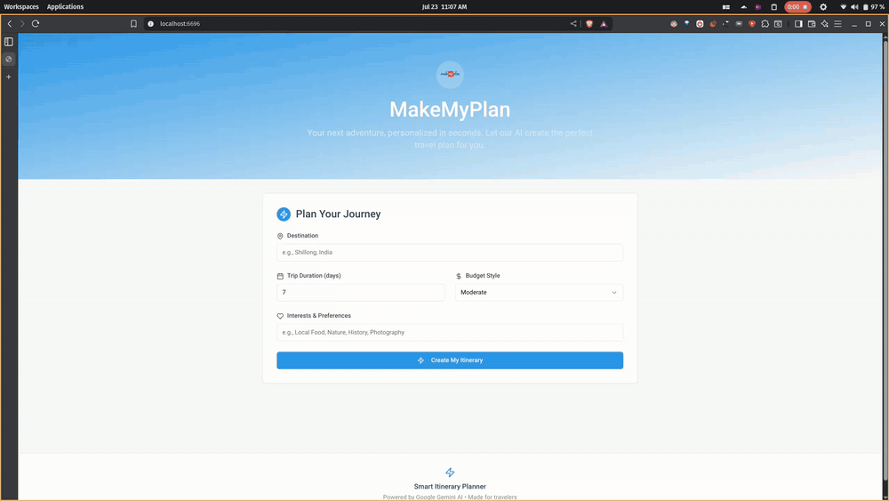

# 🌍 MakeMyPlan

**MakeMyPlan** is a full-stack web application that creates **AI-powered travel itineraries** in seconds.  
Just enter your **destination, trip duration, budget, and interests**, and MakeMyPlan will use **Google Gemini AI** to generate a **personalized day-by-day travel plan** for you.

🎯 **[👉 Live Website](https://makemyplan-1tvu.onrender.com/)** – Try it out now!  

---

## ✨ Features

✅ **AI-generated itineraries** – Personalized plans for any trip  
✅ **Simple & intuitive UI** – Just enter a few details and go  
✅ **Budget-friendly suggestions** – Matches your spending preferences  
✅ **Day-by-day plans** – Clear travel schedules at your fingertips  

---

## 🏗 System Architecture

### 🎨 Frontend

- **React 18 + TypeScript** – Modern, fast, and type-safe
- **Tailwind CSS + shadcn/ui** – Clean and accessible styling
- **TanStack Query (React Query)** – Handles server state efficiently
- **Wouter** – Lightweight client-side routing
- **React Hook Form + Zod** – Smooth form handling and validation

### ⚙️ Backend

- **Node.js + Express.js (TypeScript)** – Robust API server
- **PostgreSQL + Drizzle ORM** – Database ready for production
- **Google Gemini API** – AI-powered itinerary generation
- **In-Memory Storage** – Easy development setup, with DB support ready

### 🔄 Shared Components

- **Zod schemas** – End-to-end type safety between frontend and backend

---

## 🔄 How It Works (Data Flow)

1️⃣ **Enter trip details** (destination, duration, budget, interests)  
2️⃣ **Frontend validation** with Zod  
3️⃣ **API call** to `/api/generate-itinerary`  
4️⃣ **Express server** validates data & builds AI prompt  
5️⃣ **Google Gemini** generates a personalized itinerary  
6️⃣ **Server returns structured data** to the frontend  
7️⃣ **UI updates** to show your itinerary (with a toast notification)  

---

## 📦 Key Dependencies

- **Google Gemini API** – AI-powered travel planning  
- **Neon PostgreSQL** – Database hosting (ready for scaling)  
- **Tailwind CSS & shadcn/ui** – UI styling and components  
- **Vite** – Lightning-fast frontend build tool  
- **Drizzle ORM** – Type-safe database layer  

---

## 🚀 Deployment

- **Frontend**: Built with Vite → served from Express  
- **Backend**: Bundled with esbuild → runs as Node server  
- **Database**: PostgreSQL via `DATABASE_URL`  
- **AI**: Google Gemini API (secured with `GEMINI_API_KEY`)  

---

## 🔗 Quick Links

🌍 **Live Website:** [https://makemyplan-1tvu.onrender.com/](https://makemyplan-1tvu.onrender.com/)  
📂 **Repo:** MakeMyPlan project files & structure  
